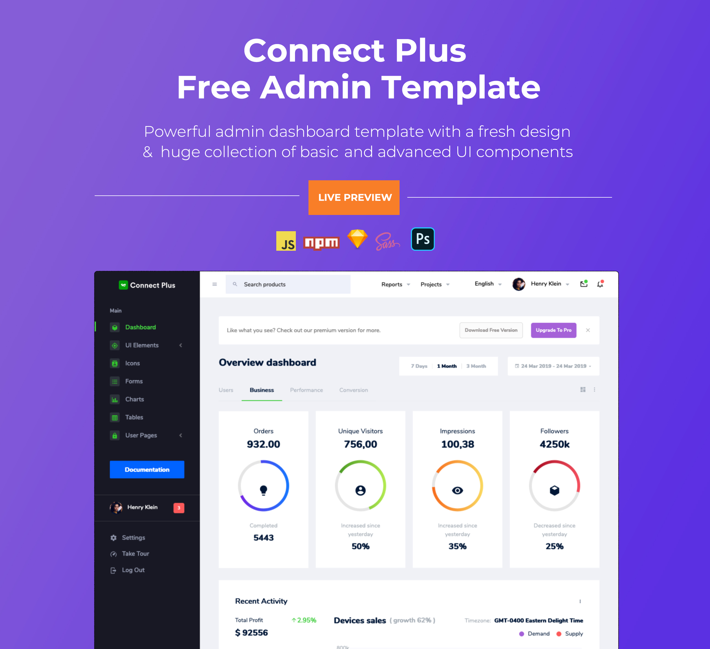

<h1>Connect Plus Free Admin Template</h1>
Connect Plus Admin es una plantilla de administrador receptiva y gratuita construida con Bootstrap 5. La plantilla tiene un diseño colorido, atractivo pero simple y elegante. La plantilla está bien elaborada, con todos los componentes diseñados y organizados cuidadosamente dentro de la plantilla.
Connect Plus Admin está equipada con todas las funciones que se adaptan a tus necesidades, pero sin abarrotarse con componentes que ni siquiera usarías. Es perfecta para construir paneles de administración, sistemas de comercio electrónico, sistemas de gestión de proyectos, CMS o CRM.

Aunque la plantilla tiene un diseño único, es fácilmente personalizable para adaptarse a tus requisitos. Connect Plus Admin viene con un código limpio y bien comentado, lo que facilita trabajar con la plantilla. Por lo tanto, es una elección ideal para comenzar tu proyecto rápidamente.

<h1>Créditos:</h1>
Bootstrap 5
Material Design Icons
jQuery
Gulp
Chart.js
jquery-circle-progress
<h1>Compatibilidad con navegadores:</h1>
Connect Plus Admin está diseñado para funcionar perfectamente con todos los navegadores web modernos y más recientes.

Chrome (última versión)
Firefox (última versión)
Safari (última versión)
Opera (última versión)
IE10+
<h1>Información de la licencia:</h1>
Connect Plus Admin se publica bajo la licencia MIT. Connect Plus Admin es una plantilla de administrador Bootstrap 5 gratuita desarrollada por BootstrapDash. Siéntete libre de descargarla, usarla, compartirla y ser creativo con ella.

<h1>¿Cómo utilizar Connect Plus Admin?</h1>
1 - Haz clic en el botón "Clone or Download" en GitHub y descárgalo como un archivo ZIP, o puedes ingresar el comando "git clone https://github.com/BootstrapDash/ConnectPlusAdmin-Free-Bootstrap-Admin-Template" en tu terminal para obtener una copia de esta plantilla.

2 - Una vez que se hayan descargado los archivos, obtendrás una carpeta con todos los archivos necesarios.

3 - Puedes instalar todas las dependencias de la plantilla ejecutando el comando "npm install". Una vez que ejecutes este comando, todos los archivos necesarios estarán en los módulos de nodo.

4 - Encuentra el archivo llamado "index.html" y verifica qué componentes necesitas. Abre el archivo en un editor de texto y comienza a editar.

5 - Ahora que tu proyecto ha comenzado, lo único que necesitas hacer es codificar, codificar y codificar a tu gusto.

<h1>¿Cómo contribuir?</h1>
Nos encantan tus contribuciones y las recibimos con gusto. Creemos que cuantos más, mejor.
Para contribuir, asegúrate de tener Node.js y npm instalados. Ahora ejecuta el comando "gulp --version". Si el comando muestra el número de versión de Gulp, significa que tienes Gulp instalado. Si no lo tienes, debes ejecutar el comando "npm install --global gulp-cli" para instalar Gulp.

<h2>Siguiente</h2>
Después de haber instalado Gulp, sigue los pasos a continuación para contribuir.
 
1 - Haz un fork y clona el repositorio de Connect Plus Admin.
 
2 - Ejecuta el comando "npm install" para instalar todas las dependencias.
 
3 - Ingresa el comando "gulp serve". Esto abrirá Connect Plus Admin en tu navegador predeterminado.
 
4 - Haz tu valiosa contribución.
 
5 - Envía una solicitud de extracción (pull request).

  

¿Necesitas una plantilla con más características y funcionalidades? Obtén más con nuestra colección de plantillas premium que incluyen complementos adicionales, animaciones llamativas, componentes de interfaz de usuario y páginas de ejemplo, todo ello con un diseño de alta calidad.
Visita <a href="https://www.bootstrapdash.com" target="_blank">https://www.bootstrapdash.com</a> para obtener más plantillas de administrador.